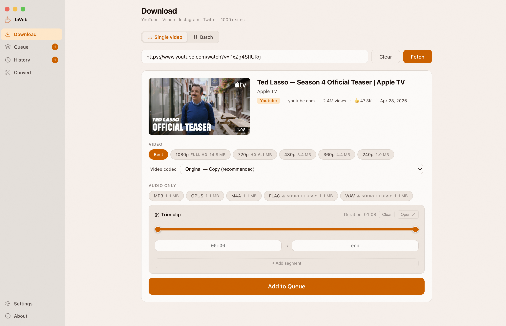

<div align="center">


# bWeb

Download videos and audio from anywhere — YouTube, Vimeo, Twitter/X, Instagram,
and [1000+ other sites](https://github.com/yt-dlp/yt-dlp/blob/master/supportedsites.md).
Everything runs locally on your machine. No cloud, no subscriptions, no tracking.

**[Download the latest release](https://github.com/CellPod/bweb/releases/latest)**

</div>

<br/>

<p align="center">
  
</p>

---

## Download & Install

**[→ Download the latest release](https://github.com/CellPod/bweb/releases/latest)**

Go to the Releases page, scroll down to **Assets**, and pick the file for your system:

| Platform | File |
|---|---|
| macOS (Apple Silicon) | `bWeb-x.x.x-arm64.dmg` |
| Windows | `bWeb-Setup-x.x.x.exe` |
| Linux | `bWeb-x.x.x.AppImage` |

> Only Apple Silicon Macs are built at the moment — no Intel (`x64`) mac build is published yet.

No dependencies to install. yt-dlp and ffmpeg are bundled inside the app.

### macOS

1. Download the `.dmg` file
2. Open it and drag bWeb to your Applications folder
3. Open bWeb

bWeb is not code-signed with an Apple certificate, so macOS will block it on first launch. On macOS Sequoia and Sonoma it shows **"bWeb is damaged and can't be opened"** — the app is fine, macOS is just enforcing its quarantine policy.

**To fix it, open Terminal and run:**

```bash
xattr -cr /Applications/bWeb.app
```

Then double-click bWeb again — it opens normally from that point on.

> If you haven't moved it to Applications yet, run `xattr -cr` on the `.dmg` file first:
> ```bash
> xattr -cr ~/Downloads/bWeb-*.dmg
> ```

You only need to do this once.

### Windows

1. Download and run the `.exe` installer
2. If SmartScreen appears, click **More info → Run anyway**
3. bWeb installs automatically and creates a shortcut

Installs per-user — no admin required. Uninstall from **Settings → Apps**.

### Linux

1. Download the `.AppImage` file
2. Make it executable: right-click → Properties → Permissions → **Allow executing as program**
3. Double-click to run

---

## Features

### Download
- **Single video** — Paste a URL, preview the metadata and thumbnail, pick a quality (4K / 2K / 1080p / 720p / 480p or lower), download as MP4 or extract audio as MP3, M4A, OPUS, FLAC, or WAV
- **Playlist** — Paste a playlist URL, select which items to download, pick a format for the whole batch
- **Batch mode** — Paste up to 50 URLs at once, pick a quality preset, add them all to the queue
- **Trim before download** — Scrub a real preview player (or drag the range slider — both stay in sync) to pick start/end points before adding to queue, or use "Mark start/end" while it plays. Supports multiple segments. Works on **live streams** too: since the total duration isn't known yet, marking is based on elapsed time since the broadcast actually started, and the download uses yt-dlp's `--live-from-start` to grab just that part

### Queue
- Sequential processing with real-time progress per item
- Pause, retry failed, clear done, or cancel all — one failure never stops the rest
- Active download strip always visible at the bottom
- In-progress downloads survive an app quit or crash — they resume as pending on next launch
- A download that stalls for 5 minutes with no progress is auto-cancelled instead of blocking the rest of the queue

### Convert
- Drop any local video or audio file to convert or trim it
- Supports MP4, MKV, MOV, AVI, WebM, MP3, WAV, FLAC, M4A, and more
- Trim with a visual timeline before converting
- Cancel mid-conversion — no partial output file left behind

### Account sign-in
- **YouTube** — Sign in to access age-restricted, private, and members-only videos. Your credentials go directly to Google through their standard login page
- **Instagram** — Sign in to download from your saved collections. The app opens Instagram's login page directly — your password is never stored

### Instagram saved collections
yt-dlp doesn't support saved collections natively. bWeb bridges the gap with a built-in scraper:
1. Sign in via **Settings → Instagram Account**
2. Paste a saved collection URL
3. The app opens the page in a hidden browser, scrolls through it, and collects all post links
4. Results appear in a playlist-style picker — select what you want and queue

### Interface
- **French / English** — Full bilingual UI, toggle in Settings
- **6 accent colors** — Blue, Indigo, Purple, Teal, Tomato, Amber — the app logo changes color with your selection
- **Light and dark mode** — Follows your system preference, or force one in Settings
- **Download history** — Quick access to all previously fetched videos with cached metadata

### Settings
- **Download location** — Change where files are saved (defaults to `~/Downloads/bWeb`)
- **Language, theme, accent color** — see Interface above
- **Automatic updates** — Off by default. When a new version is found, you're asked once whether to enable it — nothing is ever downloaded or installed without your say-so. If you decline, you'll still see a plain notification with a link to grab the update manually; you're only asked again for the *next* new version

---

## Usage

1. Paste a video or playlist URL and click **Fetch**
2. Pick a quality or audio format
3. Click **Add to Queue**
4. Go to **Queue** and click **Start Queue**

Files are saved to `~/Downloads/bWeb` by default. Change the location in **Settings → Storage**.

You can paste and fetch multiple URLs back-to-back — each result lands in a side panel so you can review and queue them one by one.

---

## Build from Source

```bash
git clone https://github.com/CellPod/bweb.git
cd bweb
npm install
npm run dev
```

`npm install` downloads yt-dlp and ffmpeg automatically for your platform.

### Builds

```bash
npm run build:mac      # macOS — .dmg + .zip
npm run build:win      # Windows — NSIS installer
npm run build:linux    # Linux — AppImage
```

For Apple Silicon:

```bash
npm run build:mac -- --arm64
```

### Cross-platform builds

If you're building for a different architecture, set environment variables before `npm install`:

**Windows (x64) from macOS:**
```bash
export npm_config_platform=win32
export npm_config_arch=x64
rm -rf node_modules bin
npm install
npm run build:win
```

**Linux (x64):**
```bash
export npm_config_platform=linux
export npm_config_arch=x64
rm -rf node_modules bin
npm install
npm run build:linux
```

---

## Project Structure

```
bweb/
├── src/
│   ├── main/
│   │   ├── main.js         # Electron main process — window, IPC, history
│   │   ├── preload.js      # Context bridge (window.api)
│   │   ├── ytdlp.js        # yt-dlp integration — spawn, parse, download
│   │   ├── queue.js        # Sequential download queue with per-item state
│   │   ├── cookies.js      # YouTube + Instagram cookie auth
│   │   ├── scraper.js      # Instagram collection scraper (BrowserWindow)
│   │   ├── converter.js    # Local file conversion via ffmpeg
│   │   ├── updater.js      # Update checker via GitHub Releases API (shows a banner/link)
│   │   │                   # electron-updater (in main.js) handles auto-update once opted in
│   │   ├── localServer.js  # Loopback-only HTTP server the renderer loads from (not file://,
│   │   │                   # so the YouTube trim preview embed is allowed to load)
│   │   └── utils.js        # Dev mode flag, logging helpers
│   └── renderer/
│       ├── index.html      # UI structure
│       ├── renderer.js     # UI logic, state, rendering
│       ├── i18n.js         # EN/FR translations and language toggle
│       └── index.css       # All styles
├── scripts/
│   ├── postinstall.js      # Downloads yt-dlp + Deno binaries on npm install
│   └── fix-ffmpeg-win.js   # Renames ffmpeg binary for Windows builds
├── bin/                    # yt-dlp + Deno binaries (auto-populated by postinstall)
├── build/                  # App icons (icon.icns, icon.ico, icon.png)
├── package.json
├── LICENSE
└── README.md
```

---

## Credits

- [ArcDLP](https://github.com/archisvaze/arcdlp) by Archis — the foundation this project is built on (MIT)
- [yt-dlp](https://github.com/yt-dlp/yt-dlp) — the engine that does all the downloading
- [Electron](https://www.electronjs.org/) — desktop app framework
- [ffmpeg](https://ffmpeg.org/) — audio/video processing (bundled via ffmpeg-static)

---

## License

[MIT](LICENSE) — see the license file for details.
